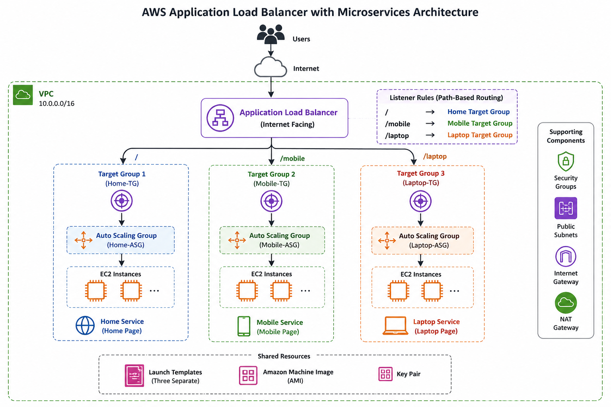
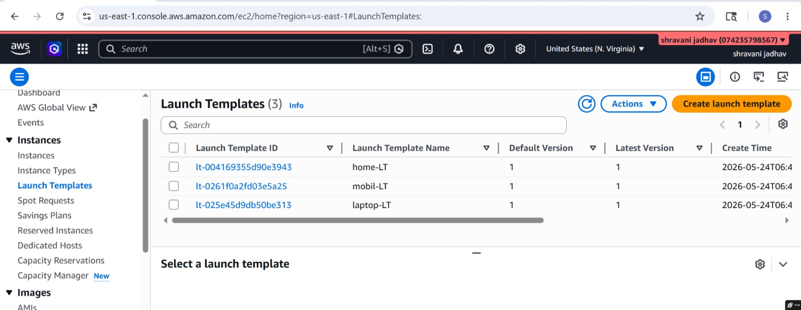
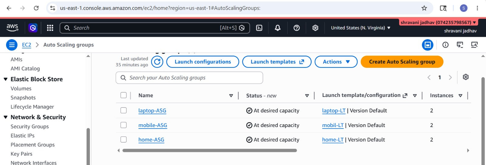
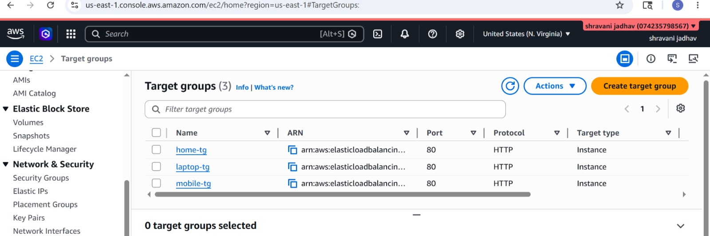
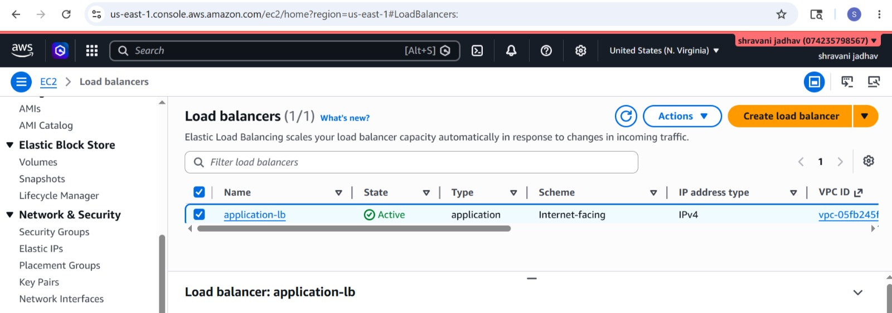
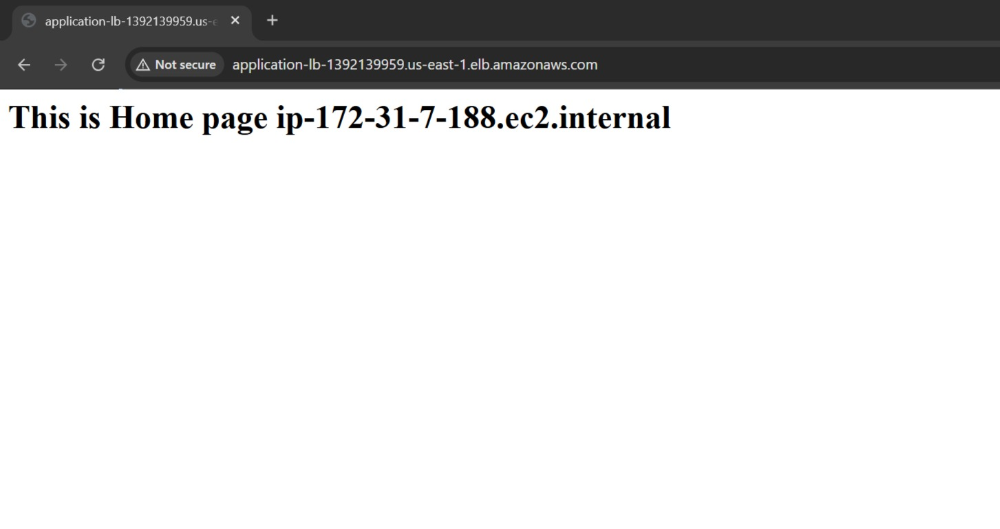
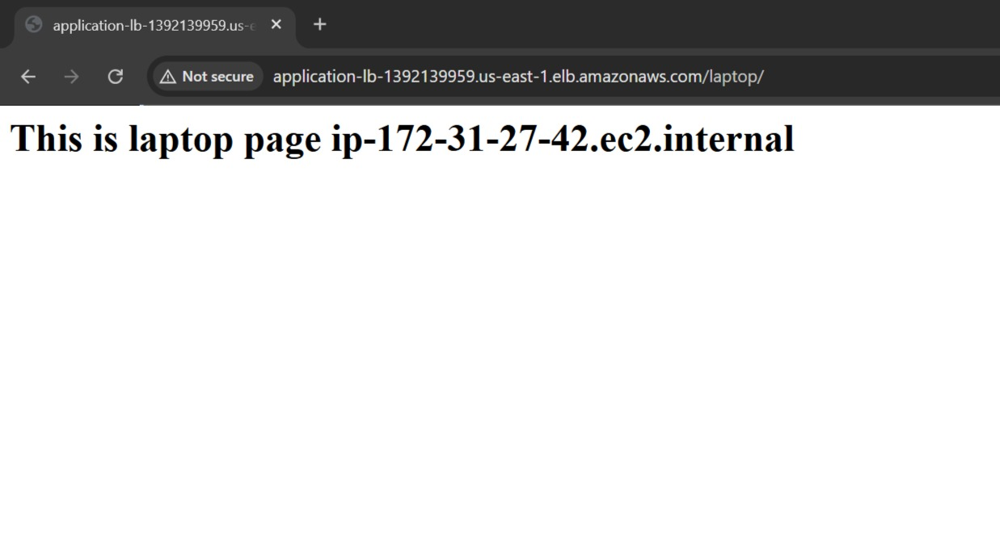
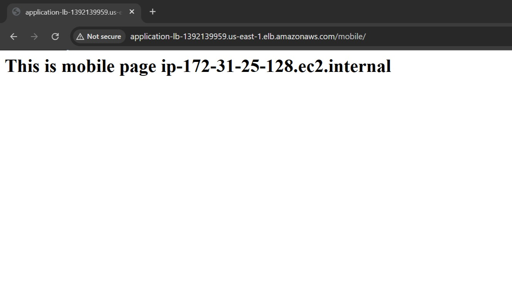

# AWS Application Load Balancer with Microservices Architecture
# INTRODUCTION
A simple microservices-based web application deployed on AWS using Application Load Balancer (ALB), EC2, Auto Scaling Groups, Launch Templates, and Target Groups.<br>

The application consists of three independent services:<br>

🏠 Home Service<br>
📱 Mobile Service<br>
💻 Laptop Service<br>

Each service runs on its own EC2 instance and is managed independently through Auto Scaling Groups. The Application Load Balancer routes incoming requests to the appropriate backend service based on URL path rules.
# Architecture Diagram

# Project Overview
This project demonstrates how an Application Load Balancer distributes incoming traffic across multiple backend microservices running on separate EC2 instances.<br>

Each microservice is deployed independently and configured with:<br>

* Dedicated EC2 Instance
* Launch Template
* Auto Scaling Group
* Target Group

The ALB forwards requests to the correct target group using path-based routing.<br>
# Architecture
```bash
                    Internet
                        │
                        ▼
          Application Load Balancer
                        │
     ┌──────────────────┼──────────────────┐
     │                  │                  │
     ▼                  ▼                  ▼
 Target Group 1    Target Group 2    Target Group 3
(Home Service)    (Mobile Service)  (Laptop Service)
     │                  │                  │
     ▼                  ▼                  ▼
 Auto Scaling      Auto Scaling      Auto Scaling
    Group              Group              Group
     │                  │                  │
     ▼                  ▼                  ▼
 EC2 Instance      EC2 Instance      EC2 Instance
(Home Page)      (Mobile Page)     (Laptop Page)
```
# AWS Services Used
* Amazon EC2
* Application Load Balancer (ALB)
* Auto Scaling Group (ASG)
* Launch Templates
* Target Groups
* Amazon VPC
* Security Groups
* Internet Gateway
# Project Components
## 🏠 Home Service
* Hosted on a dedicated EC2 Instance
* Registered with Home Target Group
* Managed by its own Auto Scaling Group
## 📱 Mobile Service
* Hosted on a separate EC2 Instance
* Registered with Mobile Target Group
* Managed by its own Auto Scaling Group
## 💻 Laptop Service
* Hosted on another EC2 Instance
* Registered with Laptop Target Group
* Managed by its own Auto Scaling Group
# Infrastructure Configuration
## EC2 Instances

Each service runs on its own Amazon EC2 instance.<br>

Configuration:<br>

* Amazon Linux 2
* Apache HTTP Server
* Custom HTML Page
* Security Group allowing HTTP (Port 80)

# Launch Templates

Three separate Launch Templates were created:<br>

* Home Launch Template
* Mobile Launch Template
* Laptop Launch Template

Each Launch Template includes:<br>

* Amazon Machine Image (AMI)
* Instance Type
* Security Group
* Key Pair
* User Data Script
# Auto Scaling Groups

Three independent Auto Scaling Groups were configured.<br>
```bash
| Auto Scaling Group | Service        |
| ------------------ | -------------- |
| Home-ASG           | Home Service   |
| Mobile-ASG         | Mobile Service |
| Laptop-ASG         | Laptop Service |
```
Each Auto Scaling Group automatically launches and maintains EC2 instances using its corresponding Launch Template.<br>
# Target Groups

Three Target Groups receive traffic from the Application Load Balancer.<br>
```bash
| Target Group | Backend Service |
| ------------ | --------------- |
| Home-TG      | Home Service    |
| Mobile-TG    | Mobile Service  |
| Laptop-TG    | Laptop Service  |
```
Health checks ensure that only healthy instances receive incoming requests.<br>
# Application Load Balancer

The Application Load Balancer acts as the single entry point for users.<br>

It distributes incoming traffic to the appropriate backend service using Path-Based Routing.<br>

Routing Rules:<br>
```bash
/

→ Home Service

/mobile

→ Mobile Service

/laptop

→ Laptop Service
```
# Reqeust Flow
```bash
User
   │
   ▼
Application Load Balancer
   │
   ├────────────► Home Target Group
   │                  │
   │                  ▼
   │             Home EC2 Instance
   │
   ├────────────► Mobile Target Group
   │                  │
   │                  ▼
   │            Mobile EC2 Instance
   │
   └────────────► Laptop Target Group
                      │
                      ▼
                Laptop EC2 Instance
```
 # 🚀 Deployment Steps
 ## Step 1

Launch three EC2 instances:<br>

* Home Instance
* Mobile Instance
* Laptop Instance

## Step 2

Install Apache Web Server.<br>
```bash
sudo yum update -y
sudo yum install httpd -y
sudo systemctl start httpd
sudo systemctl enable httpd
```
## Step 3

Deploy the application.<br>

Create a separate HTML page on each EC2 instance.<br>

Example:<br>
```bash
<h1>Welcome to Home Page</h1>
```
Repeat similar steps for the Mobile and Laptop pages.<br>
## Step 4

Create three Launch Templates.<br>

* Home Launch Template
* Mobile Launch Template
* Laptop Launch Template

## Step 5

Create three Auto Scaling Groups.<br>

Associate each Launch Template with its corresponding Auto Scaling Group.<br>

## Step 6

Create three Target Groups.<br>

* Home Target Group
* Mobile Target Group
* Laptop Target Group

## Step 7

Attach each Auto Scaling Group to its corresponding Target Group.<br>

## Step 8

Create an Internet-Facing Application Load Balancer.<br>

Configure an HTTP Listener on Port 80.<br>

## Step 9

Configure Listener Rules.<br>
```bash
/

→ Home Target Group

/mobile

→ Mobile Target Group

/laptop

→ Laptop Target Group
```
## Step 10

Access the application<br>
home page<br>

laptop page<br>

mobile page<br>
